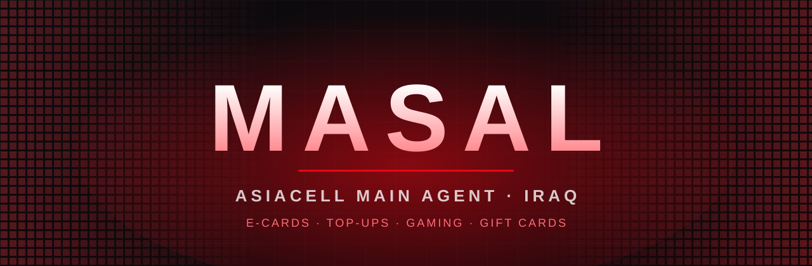

<div align="center">



<br />

# ماسال · MASAL

**A cinematic, RTL-first marketing site for Iraq's main Asiacell agent.**
Live card scanner hero · interactive service showcase · pixel-fade footer · dark & light themes.

<br />


</div>

---

## ✨ Highlights

| | |
|---|---|
| 🎴 **Card-scanner hero** | A rAF-driven card stream that "scans" into live ASCII code at the centre line, with particles and drag / swipe support. Low-res card art is upscaled and sharpened in-browser. |
| 🧭 **Editorial About** | Interactive expanding panels (story · vision · mission) with an infinite province ticker. |
| 🛍️ **Service showcase** | A giant list on one side, a 3D tilting card stage on the other. Every service has its own card — real artwork where available, hand-drawn art otherwise. |
| 🖼️ **Photo album** | Responsive mosaic with hover captions, a full-screen lightbox, keyboard + arrow navigation. |
| 🔠 **Brand wall** | 27 logo tiles on a dome with mouse parallax, floating motion and spring-in entrances. |
| 🔴 **Pixel footer** | Canvas pixels glowing and drifting from both edges and fading toward the centre, plus a back-to-top button with a scroll-progress ring. |
| 🌐 **Arabic + English** | One-click language switch in the navbar (RTL ↔ LTR). Every string lives in [`src/i18n.jsx`](src/i18n.jsx); the choice is remembered and updates `lang`, `dir` and the page title. |
| 🌗 **Dark / light themes** | Every section is designed for both; theme is driven by `data-theme` and CSS variables. |
| ♿ **Respectful motion** | `prefers-reduced-motion` is honoured across animations. |

## 🧱 Tech stack

- **React 18** + **Vite 5** (plain JS, plain CSS — no UI framework)
- **Framer Motion 11** for entrances, layout and presence animations
- **Canvas 2D** for the scanner particles and the footer pixels
- **SVG** for icons, brand marks and the hand-drawn card art
- **Simple Icons** paths (CC0) inlined in [`src/brandLogos.js`](src/brandLogos.js)

> `three` / `@react-three/*` remain in `package.json` from an earlier hero experiment and are not part of the current bundle.

## 🚀 Getting started

```bash
# 1. install
npm install

# 2. develop (http://localhost:5173)
npm run dev

# 3. production build → ./dist
npm run build

# 4. preview the build locally
npm run preview
```

Requires **Node 18+**.

## 🗂️ Project structure

```text
masal/
├── index.html                 # lang="ar" dir="rtl", SEO meta, fonts
├── public/
│   └── images/
│       ├── card-*.{webp,jpg}  # Asiacell card art used by the hero
│       ├── services/          # per-service card artwork
│       └── gallery/           # album photos
├── docs/banner.svg            # README banner
└── src/
    ├── main.jsx               # entry + stylesheet order
    ├── App.jsx                # page composition
    ├── i18n.jsx               # AR/EN dictionary + LangProvider (useLang hook)
    ├── data.js                # legacy copy (superseded by i18n.jsx)
    ├── brandLogos.js          # inline SVG paths for the brand wall
    ├── components/
    │   ├── Navbar.jsx
    │   ├── Hero.jsx · HeroBg.jsx · ScannerCardStream.jsx
    │   ├── Sections.jsx       # marquee, about, stats, services, brand wall, footer
    │   ├── Showcase.jsx       # photo album + lightbox
    │   ├── BackToTop.jsx      # square progress-ring button
    │   ├── enhanceImage.js    # canvas upscale + unsharp mask
    │   └── Fx.jsx             # shared effects (reveal, counter, cursor glow)
    └── *.css                  # one stylesheet per area (hero3, about, services, gallery, brands, final…)
```

## 🎛️ Customising

| What | Where |
|---|---|
| Any text, both languages | `src/i18n.jsx` — add or edit a key with `mk(arabic, english)` |
| Service titles & copy | `svc.list` in `src/i18n.jsx` |
| Service card images | `SV_IMGS` in [`src/components/Sections.jsx`](src/components/Sections.jsx) → files in `public/images/services/` |
| Gallery photos / captions | `ALBUM` in [`src/components/Showcase.jsx`](src/components/Showcase.jsx) (files in `public/images/gallery/`) · captions in `gal.items` |
| Brand wall logos / layout | `BRANDS` in `Sections.jsx`, paths in `brandLogos.js` |
| Colours | CSS variables on `:root` in [`src/styles.css`](src/styles.css) (`--red`, `--red2`, `--bg`, `--txt`, …) |
| Footer pixel density / opacity | `FinPixels` in `Sections.jsx` |

Drop a higher-resolution file into `public/images/services/` using the same filename to upgrade a card — small images are upscaled automatically, but real resolution always looks best.

## 🌐 Deploying

`npm run build` produces a fully static site in `dist/`. Host it anywhere that serves static files — Netlify, Vercel, Cloudflare Pages, GitHub Pages, or plain nginx.

## ⚖️ Credits & notes

- Brand logos are from [Simple Icons](https://simpleicons.org) (CC0). Brand names and marks belong to their respective owners.
- Asiacell artwork and event photos are the property of their owners and used for this showcase.

<div align="center">

<br />

**© شركة دجلة — جميع الحقوق محفوظة**

</div>
